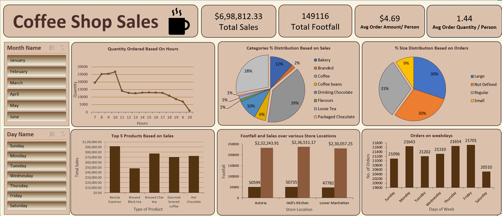

# ☕ Coffee Shop Sales Dashboard (Excel)

## 📌 Project Overview

This project is an interactive Microsoft Excel dashboard created using a Coffee Shop Sales dataset.

The dashboard provides insights into sales performance, customer footfall, product categories, store locations, and ordering trends.

---

## 📊 Dashboard Preview

## 🛠 Tools Used

- Microsoft Excel
- Pivot Tables
- Pivot Charts
- Slicers
- Conditional Formatting
- Dashboard Design

---

## 📈 Key Performance Indicators

- Total Sales
- Total Footfall
- Average Order Value
- Average Order Quantity

---

## 📊 Dashboard Features

- Monthly Sales Analysis
- Hour-wise Quantity Ordered
- Category-wise Sales Distribution
- Product Performance
- Store-wise Sales & Footfall
- Orders by Weekday

---

## 📚 Skills Demonstrated

- Data Cleaning
- Data Analysis
- Dashboard Development
- Business Reporting
- Data Visualization

---

## 📂 Dataset

Coffee Shop Sales Dataset (Public Dataset)

---

## 📌 Note
This dashboard was recreated as part of my Excel learning journey by following an online tutorial and using a publicly available dataset. I built it to practice dashboard design and data analysis techniques.
